# Programming Notes

You can work on the project using your own machine, or some other environment. However, the course staff can only support the enviroment we recommend.  You will also need to make sure that the URL you submit for part 3 works when the staff visits and grades it.


### References


The following documentation may be helpful for both learning Python and Flask:

* [Java to Python Cheatsheet](https://github.com/w4111/w4111.github.io/blob/master/java2python.md)
* [Python 2 tutorial](https://docs.python.org/2/tutorial/)
* [Python 3 tutorial](https://docs.python.org/3.7/tutorial/)
* [Learn Python The Hard Way](http://learnpythonthehardway.org/book/)
* [Flask documentation](http://flask.pocoo.org)
* [Flask Tutorial](http://flask.pocoo.org/docs/latest/tutorial/)
* [Jinja Template documentation](http://jinja.pocoo.org/)
* [Jinja Tutorial](https://realpython.com/blog/python/primer-on-jinja-templating/)

If your application has users, and you'd like to implement login/logout pages with password authentication, check:
* [Flask Quickstart: Sessions](http://flask.pocoo.org/docs/1.0/quickstart/#sessions)
* [Creating a login page](https://pythonspot.com/login-authentication-with-flask/)
    * Note: do not follow the "Connecting to your database" section of this tutorial, as it uses ORM. Remember that you are **not** allowed to use ORM, and your code must issue SQL queries instead.


### GitHub

One drawback of using a cloud computing platform is that it is difficult to open GUI text editors
such as Sublime Text to write your code.  We recommend setting up a version control system for your project, 
such as git on [GitHub](http://www.github.com), so your team can share code. This way, you can code on your desktop, commit your changes, and pull the updated changes on your cloud virtual machine.


### Flask Python Webserver (For part 3)
We strongly recommend reading the following documentations:

* [General Flask Documentation](http://flask.pocoo.org/)
* [Jinja Templates](http://jinja.pocoo.org/docs/dev/templates/): this makes it easy to send data (e.g., arrays, dictionaries) 
  to your HTML code and dynamically render them.

In part 3, we will deploy our projects on [Google Cloud Platform](https://cloud.google.com/),
an easy-to-use cloud platform that helps us host our website.

#### Step 1 Google Cloud Coupon
1. Check if you receive a coupon code from TAs. Everyone should receive individual
   Google cloud code that provides you with enough credits for the class.
2. Follow this [link](https://console.cloud.google.com/education) and remember to login with
your Lionmail account credientials.
3. Enter your credit code.

#### Step 2 Set Up Virtual Machine on GCP
1. Go to [Google Cloud Console](console.cloud.google.com)
2. Click on "Select a project" at the top of the page, and then click on
"NEW PROJECT" on the right side
   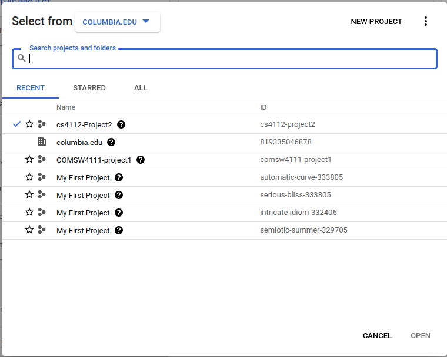
3. Enter a name for your project (e.g. "cs4111-Project1"), select
   the "Billing Account for Education" as your billing account and click "CREATE"
   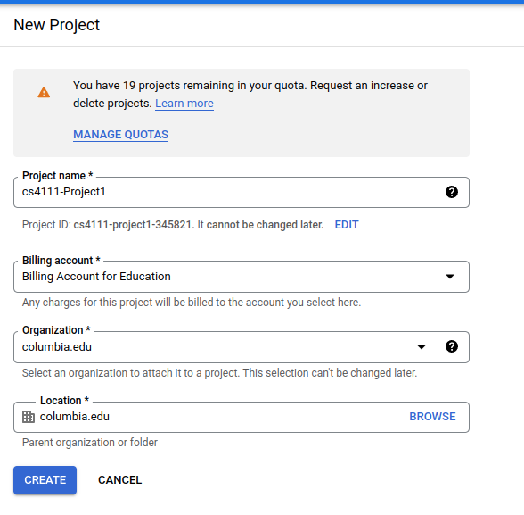
4. Make sure that the project that you just created is selected on the top navigation bar.
    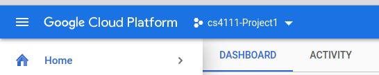
5. Click on the menu button in the top left hand corner and select "Compute Engine" and then 
"VM instances"
6. Click "CREATE INSTANCE" and enter the name for your virtual machine (e.g. cs4111-instance)
7. Change "Region" to "us-east1" and change "Zone" to any "us-east1-x"
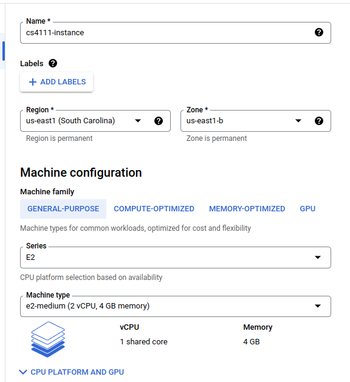
8. Click "CHANGE" on Boot disk. Change "Operating System" to "Ubuntu" and
"Version" to "Ubuntu 20.04 LTS"
   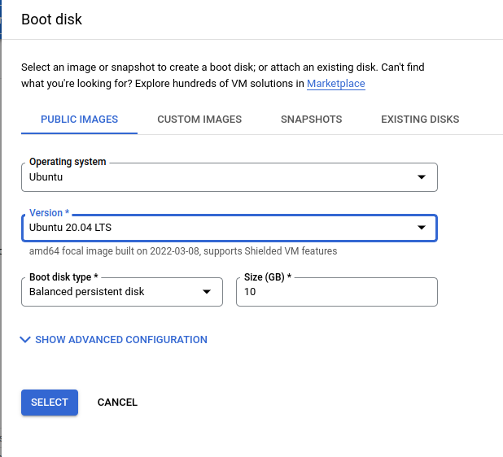
9. Change your Firewall settings to allow "HTTP" and "HTTPS" traffic.
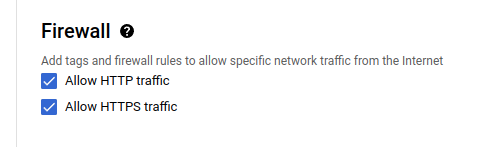
10. You should now see your VM instance running. **Remember to stop your VM when
you don't use them!**
#### Step 3 Set Up Firewall Rules
1. Go to VM instances interface, click that three dots menu, and select "View network details"
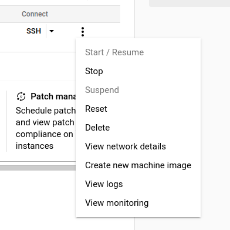
2. Choose "Firewall"
3. Choose "Create Firewall Rule"
4. Enter a name, change "Targets" to be "All instances in the network", change
"Source IPv4 ranges" to `0.0.0.0/0`, select "Specified protocols and ports", and
   set "tcp" to be `8111`. (Notice that if your application runs on different ports, you should
   specify those ports here)
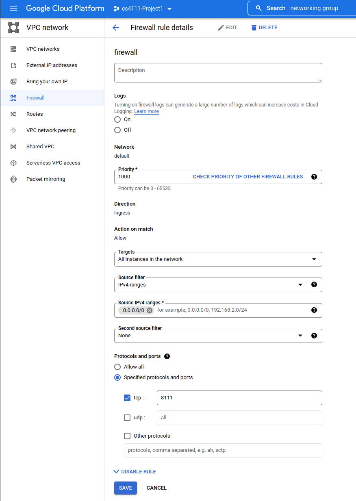
5. Click "CREATE"
6. Make sure your new firewall rule applied to your instance by clicking
"View network details again" and select "FIREWALL RULES". You should see the
firewall rule you just created appear there
   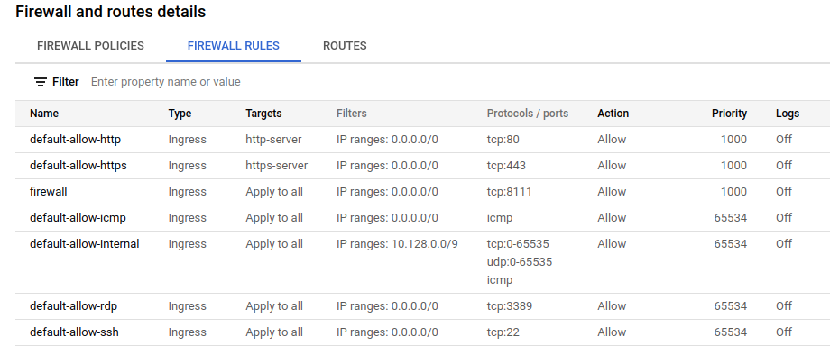
#### Step 4 Deploy Flask Application on GCP
Now, we are going to walk you through the process to deploy your 
project 1 on the VM your just created.
Suppose we already have a simple Flask application on Github that looks something
like this.
```
COMS4111_Proj1/
│   README.md
│   requirements.txt    
└───webserver/
    │   server.py
    └───static
```
`requirements.txt` includes all the packages we need for this project and 
`static` directory is where we store all our static files.

1. Click "SSH" to connect to your VM instance
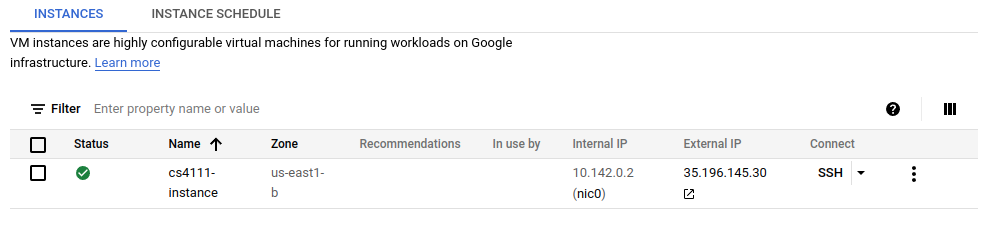

2. Now in the command line, type the following command to clone your project on github
onto the PythonAnywhere.
```
> git clone <your-github-repo-address>
```
3. You need to enter your github Username and generate a [Personal access tokens](https://docs.github.com/en/authentication/keeping-your-account-and-data-secure/creating-a-personal-access-token)
to connect to your github and download your project files. If success, the bash should look something like this.

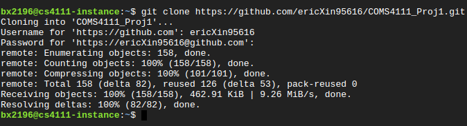

4. We now need to set up running environment for applications. Type the following commands
to install `pip` first.
```
> sudo apt-get update
> sudo apt-get install -y python3-pip
```

5. We could now use `cd` to move to the root directory of our project. And
type the following command. This command will automatically help us to install
all the packages applications needed.
```
> pip install -r requirements.txt
```
If success, the bash should look something like this

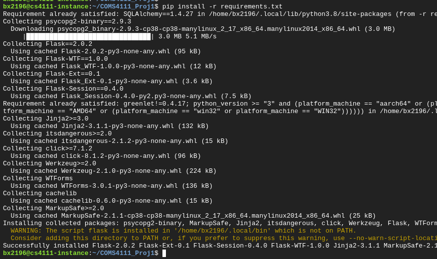

6. We have set up the environment for our Flask application. Your could run your application
locally by typing the command.
```
> python3 server.py
```

If success, you should see your application running on the port `8111`

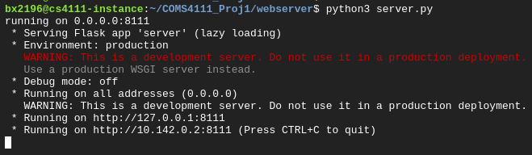

Your Flask application is running on virtual machine, but how could we access that?
You should go back to your instance interface and copy "External IP" of your VM instance. 
You should be able to access your application by entering `<External IP>:<Network Port>` in your browser. 
In this example, the external IP is `35.196.145.30` and the running port of the application is
`8111`. After entering that IP address on your browser, you should see your application is getting
HTTP requests.

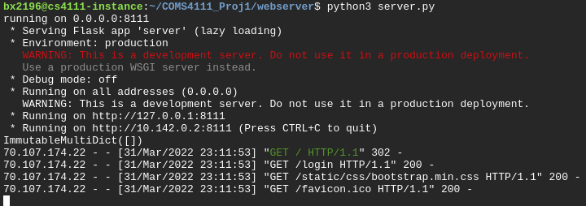

That's all! Now is the showtime!

If, unfortunately, your app is not running. One thing you need to do is to check the error log
to see what's going wrong on the sever and try to fix that. Don't hesitate to reach to TAs
when you couldn't fix the error!

### A Short Introduction to SQLAlchemy

We use a python package called `SQLAlchemy` to simplify our work for connecting to the database.
For example, `server.py` contains the following code to load useful functions from
the package:

        # import useful functions from the package
        from sqlalchemy import *

`SQLAlchemy` is able to connect to many different types of DBMSes such as 
SQLite, PostgreSQL, MySQL, Oracle and other databases.  Each such DBMS
is called an "engine".  The `create_engine()` function sets up the configuration
to specify which type of DBMS we want to connect to, and what their parameters are.

        engine = create_engine(DATABASEURI)


Given an engine, we can then connect to it (this is similar to how `psql` connects
to the staff database).

        conn = engine.connect()

At this point, the `conn` connection object can be used to
execute queries to the database.  This is basically what `psql`
is doing under the covers!  

        cursor = conn.execute("select 1")

The `execute` function takes a SQL query string as input, and
returns a `cursor` object.  You can think of this as an iterator 
over the result relation.  This means you can run `select *` 
on a million row table, and not run out of memory. Instead of
sending the entire result at once. Instead, this
object lets you treat the result as an iterator and call `.next()`
on it, or loop through it.  [See the documentation for a detailed description](http://docs.sqlalchemy.org/en/latest/core/connections.html#sqlalchemy.engine.ResultProxy).

        # this fetches the first row if called right after
        # the execute function above.  It also moves the
        # iterator to the next result row.
        record = cursor.fetchone()

        # this will fetch the next record, or None if
        # there are no more results.
        second_record = cursor.fetchone()

        # this loops through the results of the cursor one by one
        for row in cursor:
          print list(row)


The above description is a way to directly write and run SQL
queries as strings, and directly manipulate the result relations.
SQLAlchemy is also an [Object Relational Mapper](https://en.m.wikipedia.org/wiki/Object-relational_mapping)
that provides an interface that hides SQL query strings and 
result sets from you.  Instead you access and manipulate
tables in the database as if they were normal Python objects.

**In this project, you will directly write and run SQL queries, 
and will not use any ORM functionality.**


### Working with GitHub

* Fork this repository so you have your own copy that you can edit.
  You will submit a link to the repository. (click the Fork button on the top right corner of this page)
* Clone it to your VM (or your local machine, if you have Python installed and want to run locally): `git clone git@github.com:[YOUR_GITHUB_USERNAME]/project1.git`
* Edit your files
* Use the following commands to add and checkpoint (commit) your changes locally

        git add --help
        git add <new files to store in git>
        git commit -m "a sentence describing your changes"

* When everything has been committed you can `push` all the committed changes so GitHub.com has a copy

        git push

* If you cloned the repository on another machine (say the VM), then you can download and apply those
  changes from GitHub.com

        git pull

Some notes

* Your life will be easier by setting up [SSH keys](https://help.github.com/articles/generating-ssh-keys/)
  and cloning the `git://....` versions of repositories.  That way GitHub won't keep asking for your password
  when running `git` commands. However, if don't know what this means, stick to the original HTTP version.
* Most errors you will encounter can be solved by consulting a [search](http://www.google.com) [engine](http://www.bing.com).


### Running on the virtual machine
You will deploy your application to PythonAnywhere. Please refer to `Flask Python Webserver` for
step-by-step instructions on how to do that.

<!--
You will deploy your application to PythonAnywhere.

* [Steps to create an instance from Part2](./gcp_instructions.pdf).

Also, you'll need to open the firewall so you can access your web application. This is a one-time setup.

* [Steps to open firewall for Flask](./firewall_instructions.pdf).


1. Write down the external IP of your virtual machine, but remember that it changes every time you restart it.
2. Perform some default installations and scaffolding for the web-app. [Setup Instructions](./setup_instructions/setup.md).
2. Copy your code to the Google App Engine virtual machine as per instructions above or on GitHub's help pages.
3. Click on the SSH button on the Google App Engine dashboard to access your virtual machine and enter the "test" virtualenv.
4. Run the python server with the defaults, which will listen for requests on port 8111.  Run with `--help` if you need help

        cd project1/webserver
        python server.py --debug


5. Go to `http://<IP ADDRESS>:8111/` in your browser to check that it worked.  
   You will need this URL when presenting the project to your mentor.
-->

### (Optional) Running locally

**Note**: This is just a *suggestion*. Since it is impossible to support setting up Python on everyone's
personal computers, we can't really help debug issues that aren't happening on an Google App Engine VM. Your best
bet is google, office hours, or asking your fellow students on the discussion board.

It is much more convenient to be able to test your application on your laptop or local computer, and
run it on the Google App Engine VM when you are happy with the code. You can do this by following the virtualenv
setup commands from HW0 on your own computer. Once you have the correct virtualenv set up, you can
run the the web server with:

To run the webserver, go into the `webserver/` directory and run (make sure you have enabled the `virtualenv` environment)

        python server.py --debug

It should print something like:

        running on 0.0.0.0:8111
        * Running on http://0.0.0.0:8111/

The `0.0.0.0` listens to any IPv4 address on the machine.  The `8111` after the `:` is the port number.
So if this is running on your laptop, you can open you web browser to `http://localhost:8111`.

You can specify a custom port by passing a host and port as arguments:

        python server.py --debug 0.0.0.0 8888

To see its command line options, use the `--help` flag

        python server.py --help

If you run the server with the `--debug` flag, it will automatically pick up changes when you reload the page, which is more convenient than restarting the server each time. It additionally will display detailed errors in the web browser, instead of only on the console.


### (optional) Longer Term Running

The following are optional instructions on how to keep servers running. You'll need it after your project is complete, so staff can access your application to run additional tests if needed.

There are several ways to keep the server running after you have logged out of the VM.
Note that these are all poor man's techniques.

1. **nohup**.  the HUP signal is how the terminal warns a process of user logout.  the nohup
   command ensures that the process ignores this signal, allowing it to continue running.
   the "&" character at the end of the command tells the terminal to detach this process
   from the terminal.  

        nohup python server.py 0.0.0.0 8008 &
   
   
   You can kill the process explicitly by getting the process ID and using the `kill` command:

        ps -A | grep python
        kill <the ID of the python process>

2. **[tmux](https://en.m.wikipedia.org/wiki/Tmux)** is a remote terminal manager.  You can think of the terminal as two parts --  
   the client that you interact with by typing characters and pressing ENTER, and a
   server that actually reads those commands and runs processes in response.  
   Usually when you login to a VM, the client and server are tied together in a single process,
   so that when you logout the client and server both die.  TMUX on the other hand
   explicitly starts two processes -- the server process that continues to run after you log out,
   and a client process that connects to the server process. This way, even if you disconnect,
   only the client dies.  When you re-connect, you can re-attach to the server process and
   resume your terminal session!  This is what I do.  

        # install tmux
        sudo apt-get install tmux

        # run tmux
        tmux

        # it will open a terminal
        python server.py 0.0.0.0 8008

        # don't press ctrl-c, just close your window.

  Tmux is quite powerful -- come ask me directly or post to the discussion board if you are curious about its other functionalities.  GNU Screen
  is an alternative to tmux.
  
  
  
<!--
### (optional) Copy Remote Database to Local

[These](./Copy_db_to_local.md) are optional instructions on how to copy the remote database to local for testing.
-->


<!--
### Computer Accounts

If you would like to use Columbia's unix machines for this course, you will
need a CS account.  You can open one from on the [CRF webpage](https://www.cs.columbia.edu/~crf/accounts/cs.html):
and choose the appropriate "student" category as the _account type_

There is a $50 charge to open a CS account. 
Please refer to CRF's homepage for details on infrastructure and policies of the CS department.
-->
